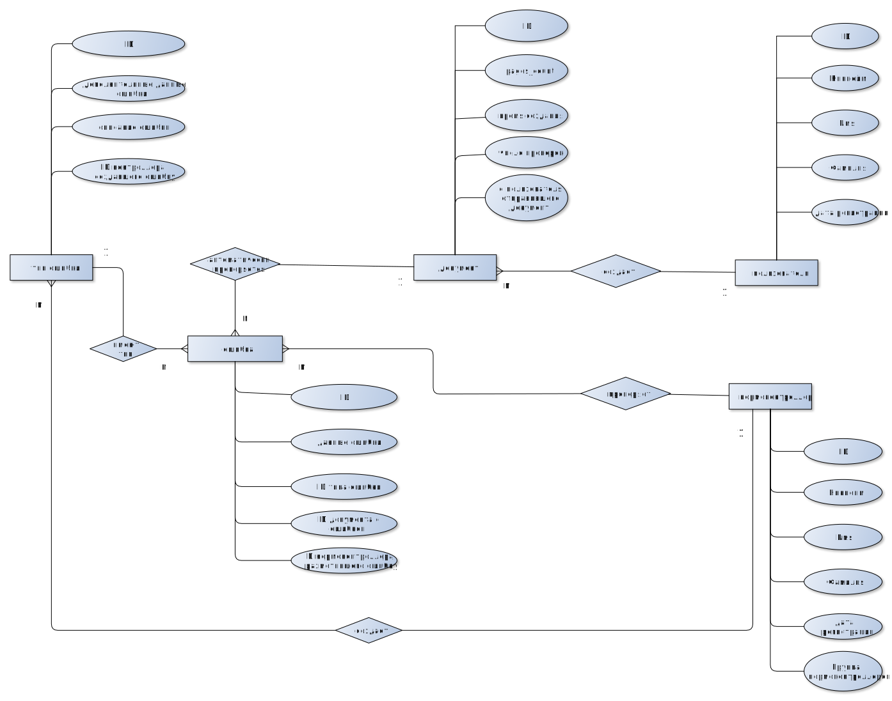

## Название проекта
Создание системы проверки соответствия документов выделенным требованиям (например ГОСТ).

## Краткое описание идеи проекта
Выделяются 2 роли: контроллер и пользователь. Контроллер размечает распространенные ошибки пользователей в соответствии с определенными стандартами (например ГОСТ 7.32), после чего на размеченных данных обучается нейросеть, решающая задачу детекции размеченных ошибок. Нейросетью рассматривается только визуальные части документов (таблицы, графики, схемы алгоритмов, формулы), датасет ошибок пользователей может дополняться во время работы системы.
Пользователь может предложить свой документ на проверку, и получить предсказания ошибок в документе от обученной нейросети.

**Проблема: большое количество времени на ручную проверку соответствия документов стандарту (например курсача).**

## Краткое описание предметной области
Документы, создаваемые и оформляемые в соответствии с определенными установленными стандартами форматирования, структурирования и содержания.
Такие стандарты могут включать в себя требования к шрифтам, отступам, заголовкам, нумерации страниц, использованию логотипов. Данные стандарты формализуются и им необходимо следовать при написании документов.

## Краткий анализ аналогичных решений по минимум 3 критериям
Решений решающих конкретно выделенную проблему не было найдено, однако были рассмотрены решения для проверки работ на соответствие ГОСТ 7.32 (ВКР ВУЗ, TestVkr) и приложение для совершения "визуального" тестирования.
Решение | Проверка элементов отчета | Наличие общего хранилища работ| Возможность динамического добавления правил
----------------------------------------------------------- | -------------------- | ----------------- | ----------------------
[ВКР ВУЗ](http://www.vkr-vuz.ru/)         | -                    | -                 | -     |
[TestVkr](https://labelme.ru/)                              | -                    | -                 | -                      |
[Applitools](https://applitools.com/)                         | +                    | -                 | +                    |
Предлагаемое решение                                        |+                    | +                 | +  |

## Краткое обоснование целесообразности и актуальности проекта

* Эффективность и точность: ручная проверка с может быть трудоемкой и подверженной человеческой ошибке. 

* Экономия времени и ресурсов: Автоматизация процесса проверки соответствия документов позволит сократить временные и человеческие затраты, ускоряя процессы разработки, производства и контроля качества.

## Краткое описание акторов
- Гость - неавторизованный посетитель.
- Авторизованный пользователь - пользователь, прошудший аутенфикацию, имеющий доступ к отправке документа на проверку.
- Нормоконтроллер - авторизованный пользователь с доступом к инструментам разметки, добавления ошибок.
- Администратор - пользователь способный управлять определением ролей в системе, имеющий привелегии в добавлении и удалении типов ошибок из датасета.

## Use-Case - диаграмма

## ER-диаграмма сущностей

## Пользовательские сценарии

1. Сценарий изменения роли пользователя user администратором:
   1. пользователь авторизируется как администратор;
   2. пользователь выбирает требуемого пользователя (user) для изменения роли;
   3. пользователь назначает user необходимую роль;
   4. пользователь выбирает сохранить/удалить ли данные внесенные user (либо разметка и типы ошибок, либо документы);
   5. пользователь подтверждает изменение роли user.
2. Сценарий удаления разметки нормоконтроллером
   1. пользователь региструрется как нормконтроллер;
   2. пользователь получает список документов с данной ошибок;
   3. пользователь просматривает размеченные документы;
   4. пользователь выбирает разметки для удаления по страницу документа + номер разметки;
   5. пользователь подтверждает удаление.
3. Сценарий отправления документа на проверку:
      1. пользователь заходит в систему;
      2. пользователь загружает документ в систему;
      3. пользователь получает список возможных ошибок.
4. Сценарий добавления разметки на не существующий до этого тип ошибки:
      1. пользователь авторизируется как нормконтроллер;
      2. пользователь загружает документы для разметки;
      3. пользователь создает новый тип ошибки;
      4. пользователь выбирает неразмеченную страницу;
      5. пользователь выбирает требуемый тип ошибки;
      6.  пользователь размечает данные нужным типом ошибки;
      7.  пользователь подтверждает создание разметки.

## Сложные пользовательские сценарии   
1. Работа с нейросетью (предобработка и т.д.);
2. Аутенфикация.

## Формализация ключевых бизнес-процессов

## Технологический стек

* Тип приложени: Web-SPA
* Backend: golang
* Frontend: React/Vue
* СУБД: PostgreSQL

## Верхнеуровневое разбиение на компоненты

## UML диаграмма классов

